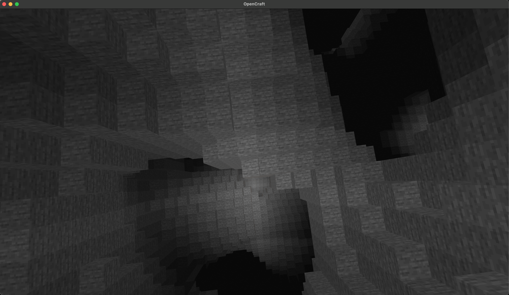

# Tasks (in order of priority)

- [x] Switch to 32 x 32 x 32 chunking
- [x] Organize codebase (pt1)
- [-] Fast, Accurate lighting calculations (offload to diff thread) (WIP)
- [-] Fast, Seamless block editing within and across chunks (Breaking blocks yes, adding blocks WIP)
- [ ] Infinite horizontal terrain generation
- [ ] Smooth lighting (WIP) — Ambient Occlusion (AO) planned; toggle support present (AmbientOcclusion var and F6 key) based on 0fps.net AO approach.
- [ ] Simple gradient skybox
- [ ] Organize codebase (pt2)
- [ ] Directional Blocks (e.g logs)
- [ ] Emissive Blocks (light)
- [ ] Degenerative Blocks ( e.g tree leaves)
- [ ] Infinite vertical terrain generation
- [ ] Destructive Blocks (tnt)
- [ ] Procedural Trees
- [ ] Structure Lab mode - creates a world a single voxel (creative), build a structure then save the world (use for in-game buildings)
- [ ] Procedurally generated procedural trees/objects
- [ ] Ui state machine + components

Snapshot Jun 28 '25

Snapshot Jun 29 '25

